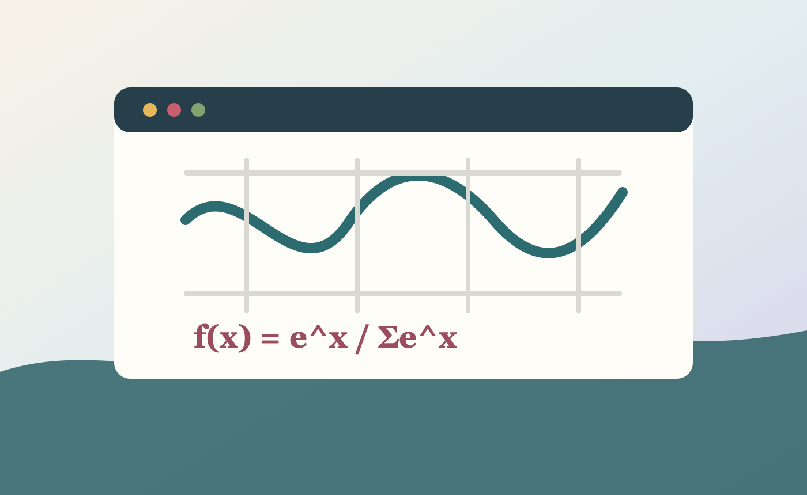

行内公式适合表达局部概念，比如 \(O(n \log n)\)、\(p(y \mid x)\) 或 \(\nabla \cdot \mathbf{u}=0\)。关键推导则适合独立成块。

$$
\operatorname{softmax}(z_i)=\frac{e^{z_i}}{\sum_{j=1}^{K} e^{z_j}}
$$

图像块适合放实验曲线、误差分布、网格结构或可视化截图。以后写文章时，可以混合段落、公式、图片和代码块。
